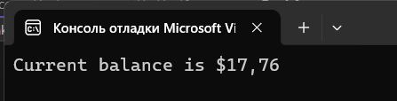

# Головин Антон и Выборнов Даниил 3ИСИП-422 практическая работа 6 часть 1
## Структура практической работы
Практическая работа состоит из 3-х модулей, а именно: основная программа и 2 теста. Один тест нацелен на Credit, а другой - на Debit.

***
## Работа программы
Программа работает корректно, без вылетов и зависаний. В ней присутсвуют исключения, если нарушено условия. 

### Итоговый код программы:
        using System;
        using System.Diagnostics;
        namespace BankAccountNS
        {
        /// &lt;summary&gt;
        /// Bank account demo class.
        /// &lt;/summary&gt;
        public class BankAccount
        {
        private readonly string m_customerName;
        private double m_balance;
        public const string DebitAmountExceedsBalanceMessage = "Debit amount exceeds balance";
        public const string DebitAmountLessThanZeroMessage = "Debit amount is less than zero";
        public const string CreditAmountLessThanZeroMessage = "Credit amount is less than zero";

        private BankAccount() { }
        public BankAccount(string customerName, double balance)
        {
            m_customerName = customerName;
            m_balance = balance;
        }
        public string CustomerName
        {
            get { return m_customerName; }
        }
        public double Balance
        {
            get { return m_balance; }
        }
        public void Debit(double amount)
        {
            if (amount > m_balance) {
                throw new System.ArgumentOutOfRangeException("amount", amount, DebitAmountExceedsBalanceMessage);
            }
            if (amount < 0)
            {
                throw new System.ArgumentOutOfRangeException("amount", amount, DebitAmountLessThanZeroMessage);
            }
        }
        public void Credit(double amount)
        {
            if (amount < 0)
            {
                throw new ArgumentOutOfRangeException("amount");
            }
            m_balance += amount;
        }
        public static void Main()
        {
            BankAccount ba = new BankAccount("Mr.Roman Abramovich", 11.99);
            ba.Credit(5.77);
            ba.Debit(11.22);
            Console.WriteLine("Current balance is ${0}", ba.Balance);
            Console.ReadLine();
        }
    }
    }

***
## Тесты
Все тесты проходят успешно, как для корректных значений, так и некорректных. Тесты ожидают конкретный результат и сравнивают с фактическим.

### Итоговый код теста 1:
        
        using Microsoft.VisualStudio.TestTools.UnitTesting;
        using System;
        
        using BankAccountNS;
        using System.Security.Principal;
        
        namespace BankTests
        {
        [TestClass]
        public class BankAccountTests
        {
        [TestMethod]
        public void Debit_WithValidAmount_UpdatesBalance()
        {
        double beginningBalance = 11.99;
        double debitAmount = 4.55;
        double expected = 7.44;

            BankAccount account = new BankAccount("Mr.Roman Abramovich", beginningBalance);

            account.Debit(debitAmount);

            double actual = account.Balance;
        }

        [TestMethod]
        public void Debit_WhenAmountIsLessThanZero_ShouldThrowArgumentOutOfRange()
        {
            // Arrange
            double beginningBalance = 11.99;
            double debitAmount = -100.00;
            BankAccount account = new BankAccount("Mr.Roman Abramovich", beginningBalance);
            // Act and assert
            try
            {
                account.Debit(debitAmount);
            } catch (System.ArgumentOutOfRangeException e)
            {
                StringAssert.Contains(e.Message, BankAccount.DebitAmountLessThanZeroMessage);
                return;
            }
            Assert.Fail("The expected exception was not thrown.");
        }

        [TestMethod]
        public void Debit_WhenAmountIsMoreThanBalance_ShouldThrowArgumentOutOfRange()
        {
            double beginningBalance = 11.99;
            double debitAmount = 20.0;
            BankAccount account = new BankAccount("Mr.Bryan Walton", beginningBalance);
            // Act
            try
            {
                account.Debit(debitAmount);
            }
            catch (System.ArgumentOutOfRangeException e)
            {
                // Assert
                StringAssert.Contains(e.Message, BankAccount.DebitAmountExceedsBalanceMessage);
                return;
            }
            Assert.Fail("The expected exception was not thrown.");
        }
    }
    }

***

### Итоговый код теста 2:

        using Microsoft.VisualStudio.TestTools.UnitTesting;
        using System;
        using BankAccountNS;
        
        namespace BankTests2
        {
        [TestClass]
        public class BankAccountTests2
        {
        [TestMethod]
        [ExpectedException(typeof(ArgumentOutOfRangeException))]
        public void Credit_WhenAmountIsLessThanZero_ShouldThrowArgumentOutOfRange()
        {
        // Arrange
        double beginningBalance = 11.99;
        double creditAmount = -100.00;
        BankAccount account = new BankAccount("Mr. Roman Abramovich", beginningBalance);

            // Act
            account.Credit(creditAmount);
        }

        [TestMethod]
        public void Credit_WhenAmountIsPositive_ShouldIncreaseBalance()
        {
            // Arrange
            double beginningBalance = 11.99;
            double creditAmount = 20.0;
            double expectedBalance = beginningBalance + creditAmount;
            BankAccount account = new BankAccount("Mr. Bryan Walton", beginningBalance);

            // Act
            account.Credit(creditAmount);

            // Assert
            Assert.AreEqual(expectedBalance, account.Balance, 0.01, "Balance was not updated correctly.");
        }
    }
    }

### Результаты:

## Выводы о тестировании
Все тесты успешно прошли и доказали работоспособность программы в случае ввода корректных и некорректных данных. Всего было написано 5 тестов, каждый из которых прошли успешно. Тесты ожидали увидеть, как и корректный результат, так и исключения в случае некорректного ввода данных. Все 5 тестов завершились успешно, так как они ожидали те данные, которые в конечном итоге получили при выполнении определенного набора действий.
