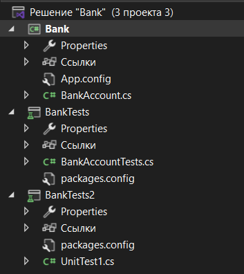

# Головин Антон и Выборнов Даниил 3ИСИП-422 практическая работа 6 часть 1
## Структура практической работы
Практическая работа состоит из 3-х модулей, а именно: основная программа и 2 теста. Один тест нацелен на Credit, другой - на Debit.
