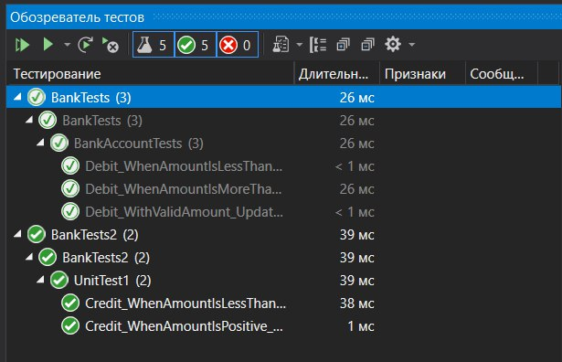

# Головин Антон и Выборнов Даниил 3ИСИП-422 практическая работа 6 часть 1
## Структура практической работы
Практическая работа состоит из 3-х модулей, а именно: основная программа и 2 теста. Один тест нацелен на Credit, а другой - на Debit.

***
## Работа программы
Программа работает корректно, без вылетов и зависаний. В ней присутсвуют исключения, если нарушено условия. 

***
## Тесты
Все тесты проходят успешно, как для корректных значений, так и некорректных. Тесты ожидают конкретный результат и сравнивают с фактическим.

***

### Результаты:

## Выводы о тестировании
Все тесты успешно прошли и доказали работоспособность программы в случае ввода корректных и некорректных данных. Всего было написано 5 тестов, каждый из которых прошли успешно. Тесты ожидали увидеть, как и корректный результат, так и исключения в случае некорректного ввода данных. Все 5 тестов завершились успешно, так как они ожидали те данные, которые в конечном итоге получили при выполнении определенного набора действий.
